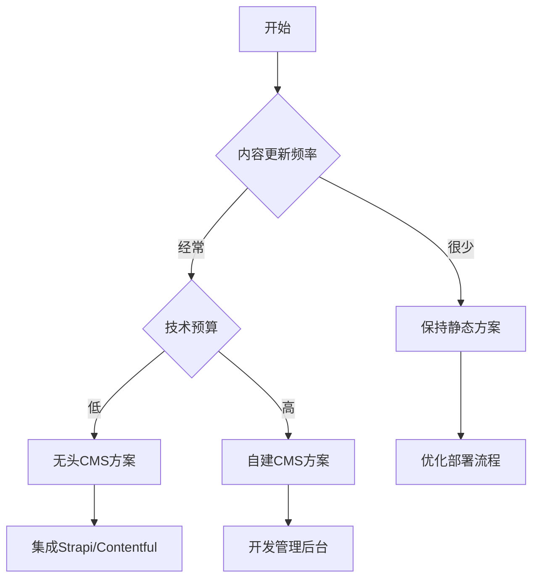

# 内容更新策略详解

## 🤔 核心问题：每次更改都要重新部署吗？

**简短回答**: 对于当前的静态网站，是的。但我们有更好的解决方案！

## 📊 不同内容类型的更新策略

| 内容类型 | 更新频率 | 推荐方案 | 是否需要重新部署 |
|----------|----------|----------|------------------|
| 公司介绍 | 很少 | 静态内容 | 是 |
| 联系方式 | 很少 | 静态内容 | 是 |
| 产品服务 | 偶尔 | 静态内容 | 是 |
| 新闻动态 | 频繁 | 动态CMS | 否 |
| 案例展示 | 经常 | 动态CMS | 否 |
| 价格信息 | 经常 | 动态CMS | 否 |

## 🏗️ 当前方案：静态内容管理

### 工作流程
```
内容修改 → 代码提交 → 自动部署 → 网站更新
```

### 优势
- ✅ **性能极佳** - 静态文件加载速度快
- ✅ **SEO友好** - 搜索引擎优化效果好
- ✅ **安全性高** - 没有数据库攻击风险
- ✅ **成本低** - 部署和维护成本低

### 劣势
- ❌ **更新麻烦** - 需要修改代码
- ❌ **技术门槛** - 需要懂一些编程
- ❌ **实时性差** - 不能即时更新

### 适用场景
- 企业官网
- 产品展示
- 个人博客
- 文档网站

## 🚀 升级方案：动态CMS集成

### 方案一：无头CMS + 静态生成

#### 推荐的无头CMS
1. **Strapi** - 开源、功能强大
2. **Contentful** - 企业级、稳定
3. **Sanity** - 实时协作
4. **Ghost** - 专注内容

#### 架构图
```
CMS后台 → API接口 → Next.js构建 → 静态网站
```

#### 实现示例
```typescript
// lib/cms.ts
export async function getArticles() {
  const response = await fetch('https://your-cms.com/api/articles')
  return response.json()
}

// app/articles/page.tsx
import { getArticles } from '@/lib/cms'

export default async function ArticlesPage() {
  const articles = await getArticles()
  
  return (
    <div>
      {articles.map(article => (
        <div key={article.id}>
          <h2>{article.title}</h2>
          <p>{article.excerpt}</p>
        </div>
      ))}
    </div>
  )
}

// 增量静态再生成
export const revalidate = 3600 // 1小时更新一次
```

### 方案二：数据库 + 服务端渲染

#### 技术栈
- **数据库**: PostgreSQL / MySQL
- **ORM**: Prisma / Drizzle
- **渲染**: 服务端渲染 (SSR)

#### 实现示例
```typescript
// lib/database.ts
import { PrismaClient } from '@prisma/client'

const prisma = new PrismaClient()

export async function getArticles() {
  return await prisma.article.findMany({
    orderBy: { createdAt: 'desc' }
  })
}

// app/articles/page.tsx
import { getArticles } from '@/lib/database'

export default async function ArticlesPage() {
  const articles = await getArticles()
  
  return (
    <div>
      {articles.map(article => (
        <article key={article.id}>
          <h2>{article.title}</h2>
          <p>{article.content}</p>
        </article>
      ))}
    </div>
  )
}
```

### 方案三：混合模式

#### 静态 + 动态内容分离
```typescript
// 静态内容（很少更新）
export async function generateStaticParams() {
  return [
    { slug: 'about' },
    { slug: 'services' },
    { slug: 'contact' }
  ]
}

// 动态内容（经常更新）
export default async function Page({ params }) {
  // 静态内容
  const staticContent = await getStaticContent(params.slug)
  
  // 动态内容
  const dynamicContent = await fetch('/api/dynamic-content', {
    next: { revalidate: 300 } // 5分钟缓存
  })
  
  return (
    <div>
      <StaticSection content={staticContent} />
      <DynamicSection content={dynamicContent} />
    </div>
  )
}
```

## 🛠️ 实施步骤

### 阶段一：评估需求
1. **分析内容类型**
   - 哪些内容经常更新？
   - 哪些内容相对固定？
   - 更新频率如何？

2. **评估技术能力**
   - 团队技术水平
   - 维护能力
   - 预算考虑

### 阶段二：选择方案


### 阶段三：实施升级

#### 方案A：集成Strapi CMS
```bash
# 1. 安装Strapi
npx create-strapi-app@latest my-cms --quickstart

# 2. 配置内容类型
# - 文章 (Article)
# - 分类 (Category)
# - 页面 (Page)

# 3. 修改Next.js项目
npm install @strapi/sdk-js
```

```typescript
// lib/strapi.ts
import { Strapi } from '@strapi/sdk-js'

const strapi = new Strapi({
  url: process.env.STRAPI_URL,
  apiToken: process.env.STRAPI_API_TOKEN
})

export async function getArticles() {
  const response = await strapi.find('articles', {
    populate: ['category', 'image']
  })
  return response.data
}
```

#### 方案B：使用Contentful
```bash
# 1. 安装Contentful SDK
npm install contentful

# 2. 配置环境变量
# CONTENTFUL_SPACE_ID=your_space_id
# CONTENTFUL_ACCESS_TOKEN=your_access_token
```

```typescript
// lib/contentful.ts
import { createClient } from 'contentful'

const client = createClient({
  space: process.env.CONTENTFUL_SPACE_ID!,
  accessToken: process.env.CONTENTFUL_ACCESS_TOKEN!
})

export async function getArticles() {
  const entries = await client.getEntries({
    content_type: 'article',
    order: '-sys.createdAt'
  })
  return entries.items
}
```

## 🔄 更新工作流程

### 静态内容工作流
```
1. 开发者修改代码
2. 提交到Git仓库
3. 触发自动部署
4. 网站更新上线
```

### 动态内容工作流
```
1. 编辑在CMS后台更新内容
2. 内容通过API发布
3. 网站自动获取新内容
4. 页面实时或定时更新
```

### 混合工作流
```
静态内容：开发者 → Git → 部署
动态内容：编辑者 → CMS → API → 网站
```

## 📈 性能优化策略

### 1. 缓存策略
```typescript
// 不同内容不同缓存时间
export const revalidate = {
  articles: 300,      // 5分钟
  products: 1800,     // 30分钟
  pages: 3600,        // 1小时
  config: 86400       // 24小时
}
```

### 2. 增量静态再生成 (ISR)
```typescript
// 页面级别的ISR
export const revalidate = 3600 // 1小时

// 按需重新验证
export async function POST(request: Request) {
  const { path } = await request.json()
  
  try {
    await revalidatePath(path)
    return Response.json({ revalidated: true })
  } catch (err) {
    return Response.json({ error: 'Error revalidating' }, { status: 500 })
  }
}
```

### 3. 边缘缓存
```javascript
// next.config.js
module.exports = {
  async headers() {
    return [
      {
        source: '/api/articles',
        headers: [
          {
            key: 'Cache-Control',
            value: 's-maxage=300, stale-while-revalidate=86400'
          }
        ]
      }
    ]
  }
}
```

## 🎯 最佳实践建议

### 1. 内容分类管理
```typescript
// 内容类型定义
interface ContentType {
  id: string
  name: string
  updateFrequency: 'static' | 'dynamic' | 'realtime'
  cacheStrategy: 'long' | 'medium' | 'short'
}

const contentTypes: ContentType[] = [
  { id: 'company-info', name: '公司信息', updateFrequency: 'static', cacheStrategy: 'long' },
  { id: 'products', name: '产品信息', updateFrequency: 'dynamic', cacheStrategy: 'medium' },
  { id: 'news', name: '新闻动态', updateFrequency: 'realtime', cacheStrategy: 'short' }
]
```

### 2. 版本控制
```typescript
// 内容版本管理
interface ContentVersion {
  id: string
  content: any
  version: number
  publishedAt: Date
  status: 'draft' | 'published' | 'archived'
}
```

### 3. 预览功能
```typescript
// 内容预览
export async function generatePreviewData(token: string) {
  const content = await getPreviewContent(token)
  
  return {
    props: { content, preview: true },
    revalidate: 1 // 1秒缓存
  }
}
```

## 🚨 迁移注意事项

### 1. 数据迁移
- 备份现有内容
- 制定迁移计划
- 测试新系统
- 逐步切换

### 2. SEO影响
- 保持URL结构
- 设置301重定向
- 更新sitemap
- 监控搜索排名

### 3. 用户培训
- 编辑人员培训
- 操作手册编写
- 权限管理设置
- 备份恢复流程

## 📊 成本分析

### 静态方案成本
- **开发成本**: 低
- **维护成本**: 低
- **服务器成本**: 极低
- **人力成本**: 中等（需要开发者更新）

### 动态CMS方案成本
- **开发成本**: 中等
- **维护成本**: 中等
- **服务器成本**: 中等
- **人力成本**: 低（编辑可自主更新）

### ROI计算
```
静态方案 ROI = 性能收益 - 更新成本
动态方案 ROI = 更新效率收益 - 技术成本
```

## 🎉 总结

选择合适的内容更新策略需要考虑：

1. **内容更新频率** - 决定技术方案
2. **团队技术能力** - 影响实施难度
3. **预算限制** - 决定方案复杂度
4. **性能要求** - 影响架构选择

**建议路径**:
1. 从静态方案开始
2. 根据实际需求逐步升级
3. 重点关注用户体验
4. 平衡性能和便利性

记住：没有完美的方案，只有最适合的方案！🎯